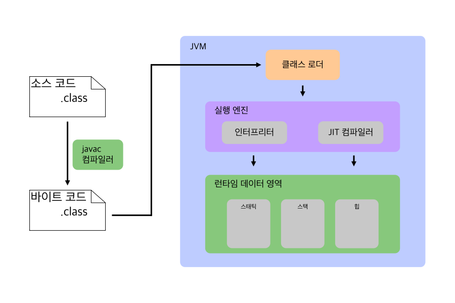

# ☕ Java

### Java란 무엇인가요?

🔎 Answer

- 객체 지향 프로그래밍 언어
- JVM 위에서 동작하여 운영체제에 독립적이다.
- Garbage Collection(가비지 컬렉션)을 통해 불필요한 메모리를 알아서 정리한다.

---

### 객체 지향 프로그래밍(OOP)의 특징은?

🔎 Answer

객체 지향 프로그래밍이란, 프로그래밍에서 `객체`를 사용하는 언어를 말합니다. 여기서의 `객체`는 고유한 속성과 동작을 갖는 데이터로 정의될 수 있습니다.

**객체 지향 기법**
- 캡슐화 : 데이터 보호
    - 정보 은닉
    - 결합도가 낮아지고 재사용이 높아짐
- 상속 : 코드 재사용
    - 상위 클래스의 특징과 기능을 물려 받음
    - 중복 코드를 줄일 수 있음.
- 다형성 : 객체 변경 용이
    - Overloading, Overriding
- 추상화 : 핵심 부분만 표현
    - 하나의 특징을 하나의 개념으로 뽑아내는 것
    - ex. 물, 콜라, 사이다 -> '마시는 것'

**객체 지향 설계 원칙(SOLID)**

- SRP
- OCP
- LSP
- ISP
- DIP

---

### Garbage Collection이 뭔가요?

🔎 Answer

- 프로그램에서 더 이상 참조되지 않는 메모리를 식별하고 해제하는 프로세스를 의미합니다.

- Java에서의 객체는 `new`를 통해 Heap Memory에 동적으로 할당이 되는데, 해당 객체에 대한 모든 참조가 사라지면 가비지 컬렉션의 대상이 됩니다.

- 메모리 누수 (Memory leaks)를 방지할 수 있어 메모리 관리가 자동화되어 개발자가 명시적으로 메모리를 할당하고 해제할 필요가 없습니다.

- Mark & Sweep 이라는 과정을 통해 참조되지 않는 객체를 탐색합니다.
  - 이 과정에서 스레드가 중단되어 성능이 떨어진다는 단점이 존재합니다.

> **요약하자면**,  
 GC는 JVM에서 메모리를 관리해주는 모듈입니다. Heap 메모리를 재활용하기 위해 더 이상 참조되지 않는 객체들을 메모리에서 제거해줍니다. 개발자가 직접 메로리를 정리하지 않아도 개발 속도를 향상시킬 수 있는 장점이 있지만, Mark & Sweep 이라는 과정에서 참조되지 않는 객체를 탐색할 때 스레드가 중단되어 성능이 떨어지는 단점이 존재합니다.

> [Garbage Collection - 망나니개발자](https://mangkyu.tistory.com/118)

---

### Java 실행 과정에 대해 설명해주세요.

🔎 Answer

1. 소스 코드 (`*.java`)가 자바 컴파일러(javac)에 의해 컴파일 됩니다.

2. 컴파일 되는 과정에서 소스 코드는 JVM(Java Virtual Machine)이 이해할 수 있는 바이트 코드(byte code) 형태로 번역이 됩니다.

3. 만약, 컴파일이 정상적으로 완료되었다면 `*.class`와 같은 확장자를 가진 바이트 코드 파일이 생성됩니다.

4. JVM은 컴파일된 바이트 코드 파일을 클래스 로더를 사용하여 파일을 JVM 내 Runtime Data Aread로 로드합니다. 이 때 필요한 클래스 파일들을 JVM 내로 로드하고 클래스 간의 의존성을 해결합니다.

5. 로딩된 클래스 파일을 Execution Engine을 통해 해석 및 실행합니다.

 

> ***요약하자면,***
> 1. 소스 코드(`*.java`)가 Java Compile에 의해 클래스 파일(`*.class`)로 변환
> 2. 클래스 파일이 Class Loader로 인해 JVM에 로딩
> 3. JVM 내의 Execution Engine(인터프리터와 JIT 컴파일러)에 의해 변환된 코드가 실행

 

> - [Compilation and Excution of a Java Program - geeksforgeeks](https://www.geeksforgeeks.org/compilation-execution-java-program/)
> - [자바의 동작 과정 - KoB](https://kingofbackend.tistory.com/123)

---

### 추상 클래스 vs 인터페이스

🔎 Answer

- 추상 클래스 : `abstract` 지시자로 정의, 추상 메서드가 한 개 이상 포함
  - 상속을 위해 등장
  - 부모의 기능을 `상속받은 자식`에서 재활용하기 위해 사용

- 인터페이스 : `interface` 지시자로 정의, 모든 메서드가 추상 메서드로 정의
  - 보장을 위해 등장
  - 인터페이스를 구현한 객체들은 모두 같은 동작을 할 수 있도록 `보장`

> **요약하자면**,  
추상 클래스는 abstract 지시자로 정의되며 추상 메서드가 한 개 이상 포함되어 있는 클래스이며,  
인터페이스는 interface 지시자로 정의되며 모든 메서드가 추상 메서드로 정의됩니다.  
>
> 이 둘의 차이는, 목적에 있으며 추상 클래스는 상속을 받아 기능을 재활용하고 확장시키는데 목적이 있다고 한다면, 인터페이스는 함수 구현을 강제함으로서 구현한 객체들이 같은 동작을 보장하는 것에 목적이 있습니다. 

 

---

### Call by Value vs. Call by Reference

🔎 Answer

- 둘은 함수 호출의 방법이라는 공통점이 존재합니다.
- Call by Value : 값에 의한 호출로 인자로 받은 값을 **복사**하여 처리합니다.
- Call by Reference : 참조에 의한 호출로, 받은 값의 **주소**를 참조하여 직접 값에 영향을 줍니다.

- Java는 무조건 Call by Value 방식을 사용하지만, 참조 타입(객체)의 경우 객체의 메모리 주소를 저장하고 있기 때문에 값에 변화가 생깁니다.

 

---

### Java Primitive Type은 무엇인가요?

🔎 Answer

- Java에는 원시 타입(Primitive Type)과 참조 타입(Reference Type)이 존재합니다.

- 원시 타입은 값 자체를 가지고 있으나, 참조 타입은 객체의 메모리 주소를 저장하고 있습니다.

- 원시 타입은 총 8가지로, byte, short, int, long, float, double, char, boolean이 있습니다.

- 원시 타입의 값은 Stack에 저장되며, 참조 타입은 Heap에 저장됩니다.

- 오토박싱, 언박싱을 통해 Primitive Type <-> Wrapper Class 사이의 자동으로 변환을 해줍니다.

# 🌼 Spring

### Spring - DI가 무엇인가요?

🔎 Answer

> Spring IoC Container == Spring Container

- 스프링 프레임워크에서 가장 중요한 개념 중 하나로, 객체 간의 의존성을 Spring Container가 관리하고 주입해주는 방식을 의미합니다.

- Spring Container는 객체(Bean)의 생성부터 모든 생명주기를 관리하는데 이를 제어의 역전(IoC: Inversion of Control) 이라고 합니다. 이를 통해 객체 간의 결합도를 낮출 수 있습니다.

- 의존성 주입 방법 : Constructor, Setter, Field 주입이 존재합니다. 하지만, 순환 참조, 필수 의존성 보장, 불변성 등의 이점이 있는 생성자(Contructor) 주입이 권장됩니다.

- DI(Dependency Injection)를 사용함으로써 객체 의존을 위해 새로운 객체를 생성 및 관리하지 않고 필요한 의존성을 외부에서 주입을 받게 됩니다.

 

